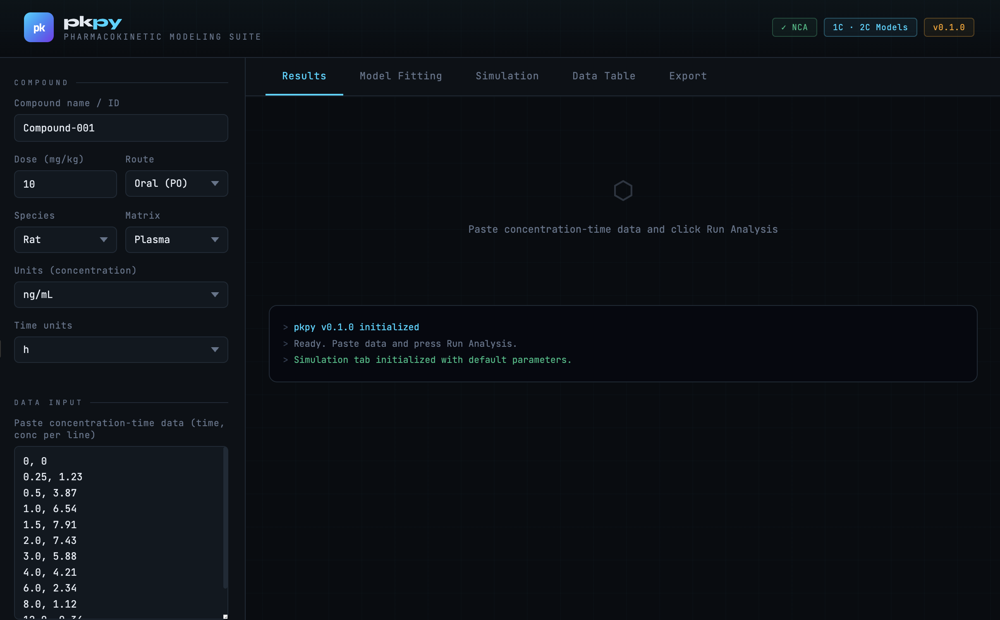
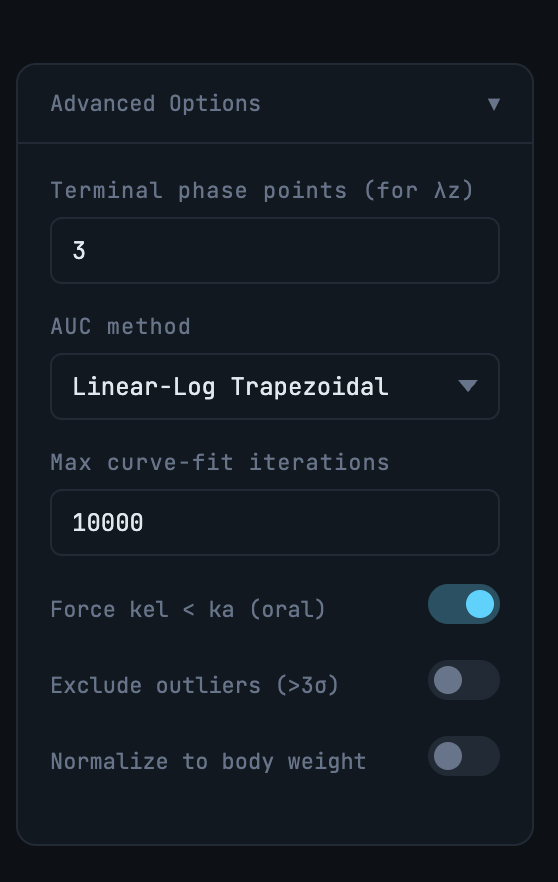
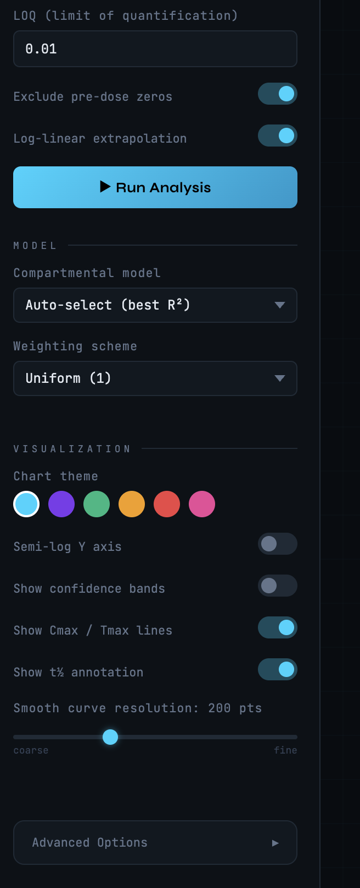
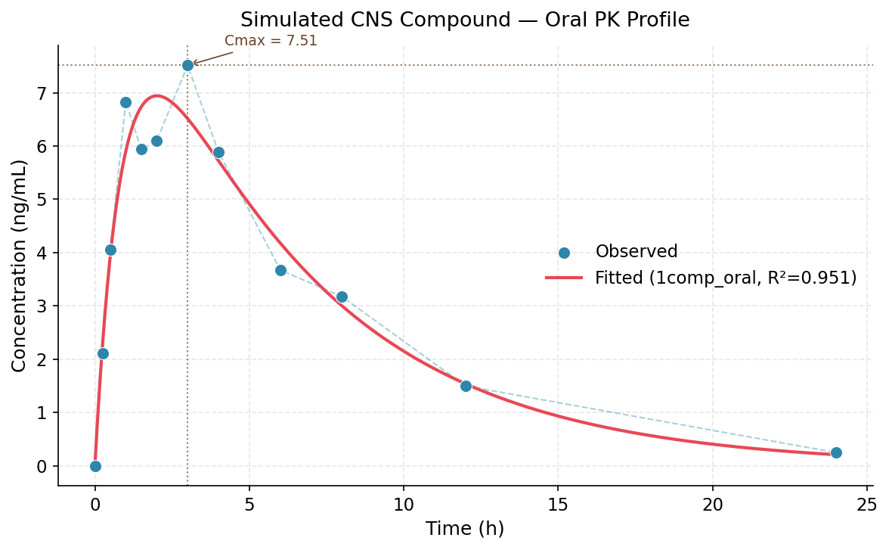
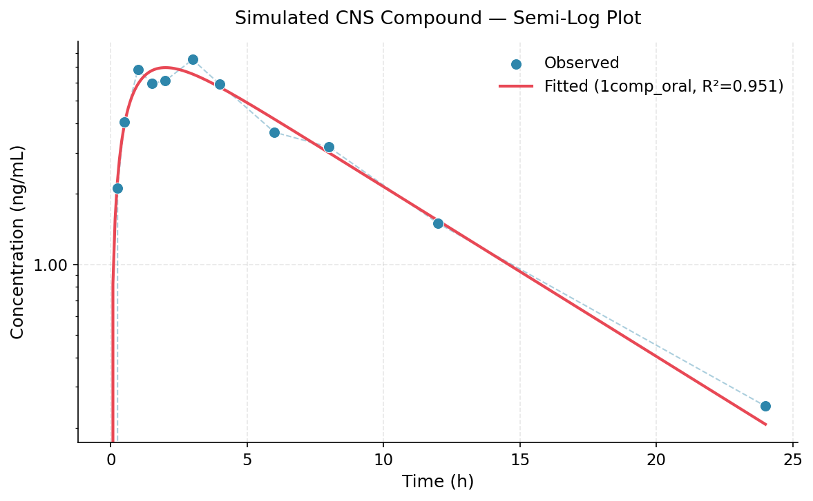
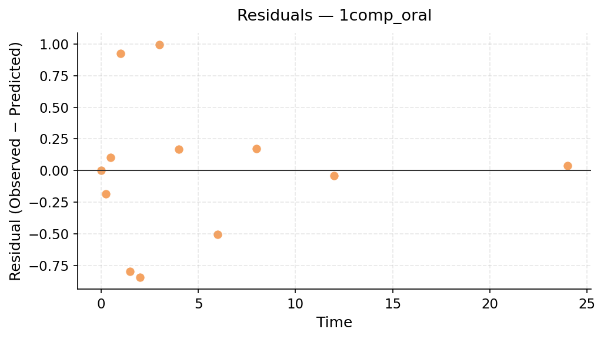

# pkpy — Open-Source Pharmacokinetic Modeling Toolkit

[](https://www.python.org/)
[](LICENSE)

A lightweight, open-source Python toolkit for **non-compartmental analysis (NCA)** and **compartmental PK modeling** — designed as an accessible alternative to WinNonlin for academic labs and small biotech teams.

Built by a neuroscience researcher with hands-on in vitro ADME and cGMP QC experience.

---

## What it does

| Feature | Details |
|---|---|
| **NCA** | Cmax, Tmax, AUC_last, AUC_inf, t½, λz, CL, Vd |
| **1-compartment IV** | C(t) = C0 · e^(−kel·t) |
| **1-compartment oral** | First-order absorption model |
| **2-compartment IV** | Bi-exponential decay |
| **Model comparison** | Fits all models, ranks by R² |
| **Plots** | Concentration-time, semi-log, residuals |

---

## Installation

```bash
git clone https://github.com/yourusername/pkpy.git
cd pkpy
pip install -r requirements.txt
```

Or install directly:

```bash
pip install -e .
```

---

## Quick start

```python
import pkpy

# Your concentration-time data
time = [0, 0.5, 1, 2, 4, 6, 8, 12, 24]   # hours
conc = [0, 3.2, 6.1, 7.4, 5.8, 3.9, 2.4, 1.1, 0.2]  # ng/mL
dose = 10  # mg/kg

# Non-compartmental analysis
nca_results = pkpy.nca(time, conc, dose=dose, route='oral')
print(nca_results)
# {'Cmax': 7.4, 'Tmax': 2.0, 'AUC_last': 54.3, 't_half': 5.1, ...}

# Fit a compartmental model
fit = pkpy.fit_model(time, conc, model='1comp_oral')
print(f"R² = {fit['r_squared']:.3f}")

# Plot
pkpy.plot_concentration_time(
    time, conc,
    fit_result=fit,
    nca_results=nca_results,
    xlabel="Time (h)",
    ylabel="Concentration (ng/mL)",
    save_path="pk_profile.png"
)
```

---

## NCA parameters

| Parameter | Description |
|---|---|
| Cmax | Maximum observed concentration |
| Tmax | Time of maximum concentration |
| AUC_last | AUC from t=0 to last measurable timepoint (lin-log trapezoid) |
| AUC_inf | AUC extrapolated to infinity |
| AUC_extrap_% | Percentage of AUC_inf from extrapolation |
| t½ | Terminal half-life = ln(2) / λz |
| λz | Terminal elimination rate constant |
| CL (or CL/F) | Clearance (IV) or apparent clearance (oral) |
| Vd (or Vd/F) | Volume of distribution |

AUC is calculated using the **linear-log trapezoidal method** — linear trapezoid on ascending segments, log trapezoid on descending — consistent with FDA and EMA NCA guidance.

---

## Compartmental models

### 1-compartment IV bolus
```
C(t) = C0 · exp(−kel · t)
```

### 1-compartment oral (first-order absorption)
```
C(t) = (F·D/Vd) · [ka / (ka − kel)] · [exp(−kel·t) − exp(−ka·t)]
```

### 2-compartment IV bolus
```
C(t) = A · exp(−α·t) + B · exp(−β·t)
```

Fitting uses `scipy.optimize.curve_fit` with physiologically bounded parameter constraints.

---

## Example output

```
--- Non-Compartmental Analysis ---
Cmax                  7.51   conc units
Tmax                  3.00   time units
AUC_last             56.92   conc·time
AUC_inf              58.47   conc·time
AUC_extrap_%          2.66   %
t_half                4.35   time units
CL/F                  0.17   volume/time

--- Model Fit (1comp_oral) ---
R²                    0.951
ka                    1.110 ± 0.257 /h
kel                   0.167 ± 0.035 /h
```

---

## Project structure

```
pkpy/
├── pkpy/
│   ├── __init__.py       # Public API
│   ├── models.py         # PK model equations
│   ├── analysis.py       # NCA + compartmental fitting
│   └── plotting.py       # Concentration-time plots
├── examples/
│   └── example_analysis.py
├── data/
│   └── example_pk_data.csv
├── tests/
├── setup.py
└── README.md
```

---
### UI 1 Profile


### UI 2 Profile


### UI 3 Profile


---

## Roadmap

- [ ] Multiple-dose / steady-state NCA
- [ ] IV infusion model
- [ ] IVIVE (in vitro to in vivo extrapolation) module
- [ ] Microsomal intrinsic clearance → hepatic clearance
- [ ] CSV batch import for multi-subject studies
- [ ] Interactive Jupyter notebook examples

---

## Example Output

### PK Profile


### Semi-log Plot


### Residuals



---

## Background

This project was built to fill a gap in open-source DMPK tooling. Commercial software like WinNonlin (Certara) and Phoenix are industry standard but cost-prohibitive for academic labs and early-stage biotechs. `pkpy` implements the core NCA and compartmental modeling workflows using fully open, auditable Python — consistent with FDA NCA guidance and ICH M10 bioanalytical method validation principles.

---

## Author

**Deb Bhattacharyya** — Neuroscience B.S., Moravian University  
GLP · cGMP · ADME · DMPK | Parkinson's Disease Research  
[LinkedIn](https://www.linkedin.com/in/dev-bhattacharyya-535431283)

---

## License

MIT License — free to use, modify, and distribute.
